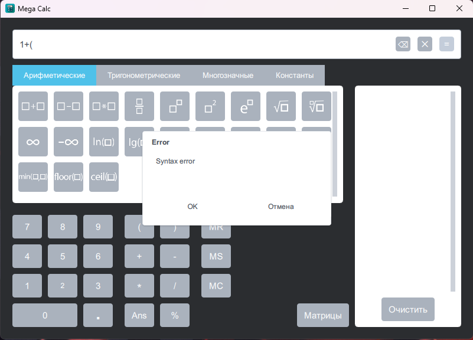
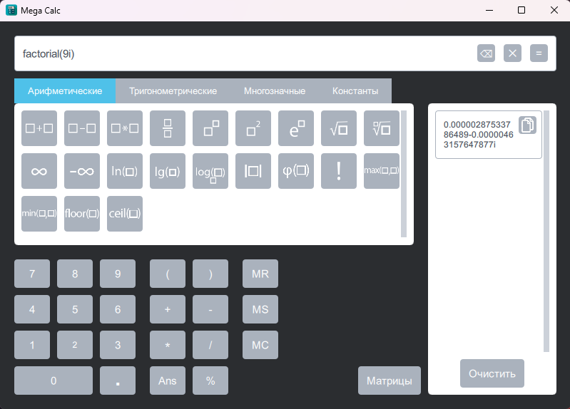
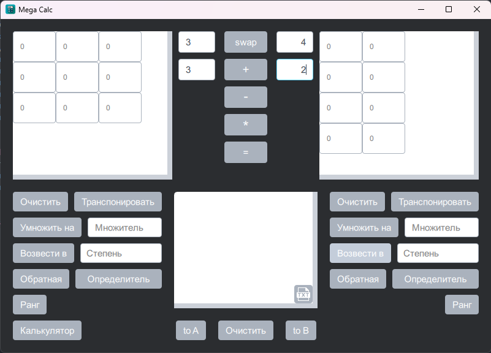

<h1 align="center">

  
Mega calc

</h1>

  

Mega calc - это курсовой проект, написанный в команде с моим [другом](https://github.com/iliacym). Программа представляет собой калькулятор матриц и строковых математических выражений с поддержкой длинной арифметики.

## Особенности :sparkles:
* Графический интерфейс
* Самописная длинная арифметика
* Вычисления как с действительными, так и с комплексными числами
* Встроенные константы, такие как `pi` и `e`, а также `inf` и `nan`
* Поддержка множества математических функций 
* Поддержка множества действий с матрицами произвольного размера
* Решение систем линейных уравнений любых видов
* Обработка ошибок в веденных выражениях
* Хранение истории вычислений

## Установка :wrench:
1. Необходимо скачать установщик из последнего [релиза](https://github.com/LuTiFlekSSer/Mega_calc/releases/latest)
2. Запустить скачанный файл и проследовать инструкциям мастера установки
3. Запустить установленную программу

## Скриншоты :camera:

## Обратная связь :mailbox:

* В случае обнаружения проблем с программой, можно создать [issue](https://github.com/LuTiFlekSSer/Spotify-downloader/issues/) с соответствующим описанием ошибки и меткой `bug`
* Предлагать улучшения можно в [issue](https://github.com/LuTiFlekSSer/Spotify-downloader/issues/) с меткой `enhancement`

___

